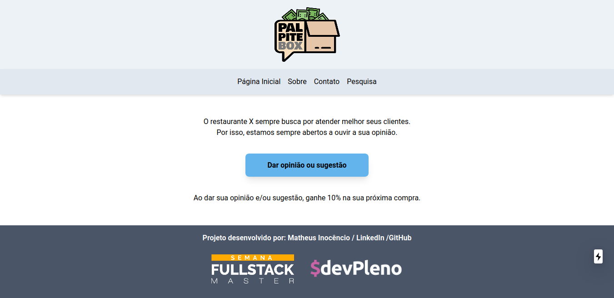
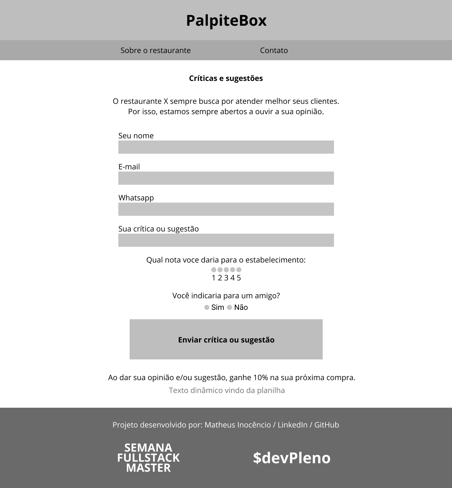

# PapiteBox



## Pré-requisitos

Você precisa estar com o [Node (versão LTS)](https://nodejs.org/pt-br/) e o [NPM](https://www.npmjs.com/) instalados na máquina.

Na pasta do projeto, insira estes comandos:

```
npm install
npm run dev
```

## Colocando em produção

Este projeto pode ser colocado em produção utilizando o [Vercel](https://nextjs.org/docs/deployment) (sem configurações extras)

## Documentação

### Requisitos funcionais

- Permitir que os clientes de um restaurante ou negócio local palpitem sobre o atendimento, produto, e entre outros. Em troca, o cliente recebe um cupom (desconto, condição especial)

### Requisitos não funcionais

- Valor estipulado para cobrança por cliente poderá ser de R$ 49,90 por mês

### Diagramas


## Leiaute




[Você também pode visualizar pelo figma.](https://www.figma.com/file/AlqUXj3i0Owebv7bs1cDYZ/palpite-box?node-id=0%3A1)

## Relatório

A aplicação foi construída utilizando:

- [NodeJS](https://nodejs.org/pt-br/)
- [NPM](https://www.npmjs.com/)
- [NextJS](https://nextjs.org/)
- [TailwindCSS](https://tailwindcss.com/)
- [Figma](https://www.figma.com/)
- [PostCSS](https://postcss.org/)
- [Google Spreadsheet](https://github.com/theoephraim/node-google-spreadsheet)

Todos os passos foram aprendidos durante o workshop [Semana Fullstack Master](https://lp.devpleno.com/semanafsm/) do [DevPleno](https://www.devpleno.com/).

## Autor

**Matheus Inocêncio Lopes** - [Linkedin](https://www.linkedin.com/in/matheusilopes)

## Licença

Este repositório está sob a [licença MIT](LICENSE).
